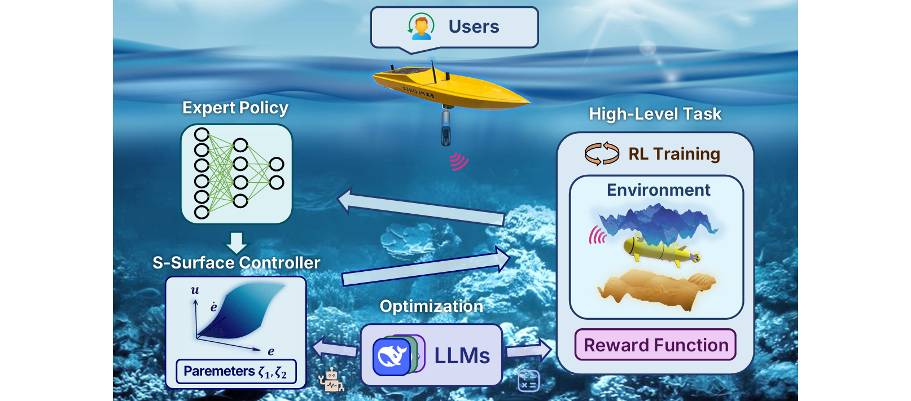
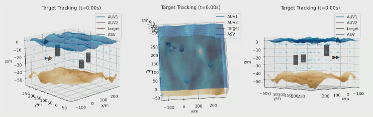

# Never too Prim to Swim

[](https://arxiv.org/abs/2503.00527)  [](https://360zmem.github.io/AUV-RSControl/) [](https://360zmem.github.io/AUV-RSControl-Code)

This repository contains the Simulator and Supplementary Materials for the paper "Never too Prim to Swim: An LLM-Enhanced RL-based Adaptive S-Surface Controller for AUVs under Extreme Sea Conditions".

:warning: Work-in-Progress Notice: This repository contains a code implementation for demonstration purposes.






## Get Started

Run this command to install the dependencies:

```bash
pip install -r requirements.txt
```

Important: The visualization module requires the H.264 codec. Download the [openh264](https://github.com/cisco/openh264) binary and place it in the project’s root directory.

Next, install our modified Python Vehicle Simulator (PVS), which includes our S-surface controller implementation:

```bash
cd PVS/
pip install -e .
```

We provide implementations for two high-level underwater tasks described in the paper. The code resides in `data_collection/`.

## 3D Data Collection Task Simulation

### Training

Execute training with:

```bash
python train_td3.py --wave --usbl
```

- `--wave`: Enables JONSWAP wave simulation.
- `--usbl`: Enables USBL positioning noise (disable to use ground-truth positions).

Additional hyperparameters (e.g., for control, simulation, TD3 algorithm) can be adjusted via command-line arguments. Refer to the source code for details.

### Evaluation

Run inference with a trained model:

```bash
python eval_td3.py
```

Arguments follow the same definitions as above.

### Outputs  
Both phases generate visualization files and logs:  
- **Training**:  
  - Visualization records: `record_train/yyyy_mm_dd_hh_mm_ss.pkl` (timestamped).  
  - Logs: Saved to `logs/`.  
- **Evaluation**:  
  - Visualization records: `record_eval/yyyy_mm_dd_hh_mm_ss.pkl`.  


### Visualization Scripts  
- **2D Visualization**:  
  ```bash  
  python genvideo_2D.py --preview -1 --fname XXX --mode train --speed 5  
  ```
  - `--preview N`: Previews `N`-th frames (negative values skip preview).  
  - `--fname`: Input filename (without `.pkl`).  
  - `--speed`: Playback speed multiplier.  
  Output: `output_2D.mp4` (H.264/AVC, 10 Mbps). Use FFmpeg for further format conversion.  

- **3D Visualization**:  
  ```bash  
  python genvideo_3D.py --preview -1 --fname XXX --mode train --speed 5  
  ```
  Parameters match the 2D script.  

## Acknowledgement

The 6-DOF simulator is adapted from the [Python Vehicle Simulator](https://github.com/cybergalactic/PythonVehicleSimulator).

## Citation

If you find the code repository useful for your work, please cite:

```bibtex
@article{xie2025AUVRScontrol,
      title={Never too Prim to Swim: An LLM-Enhanced RL-based Adaptive S-Surface Controller for AUVs under Extre Sea Conditions},
      author={Xie, Guanwen and Xu, Jingzehua and Ding, Yimian and Zhang, Zhi and Zhang, Shuai and Li, Yi},
      journal={arXiv preprint arXiv:2503.00527},
      year={2025}}
```
